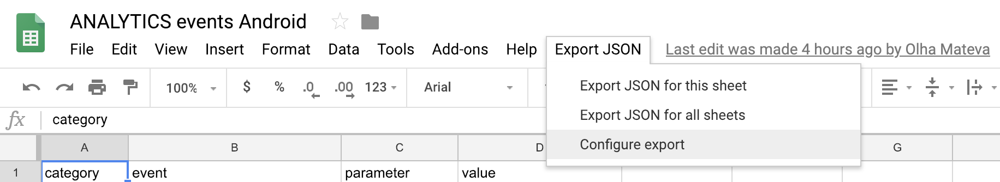
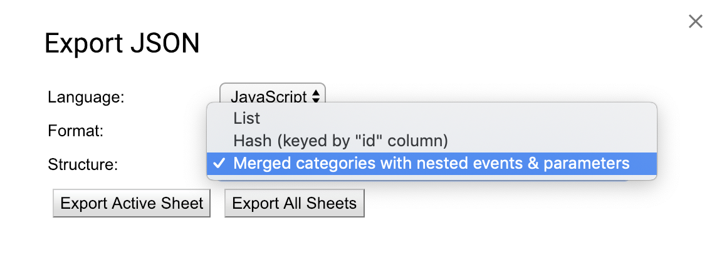
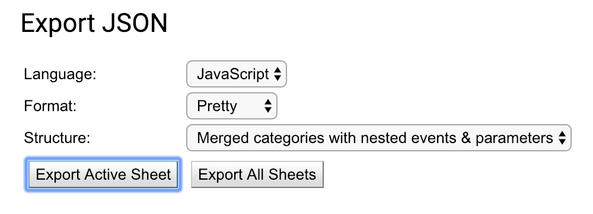
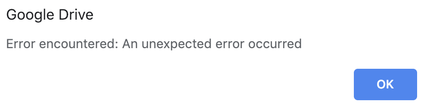
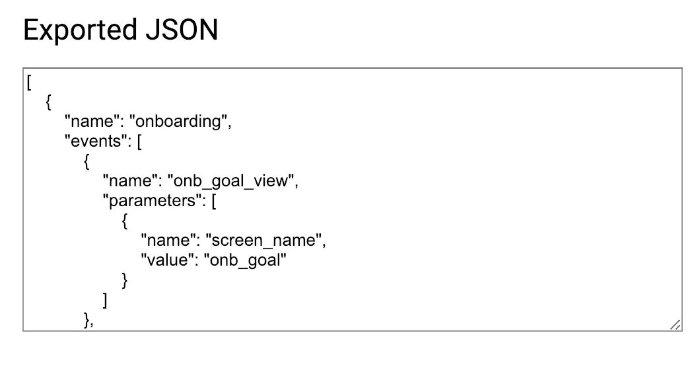
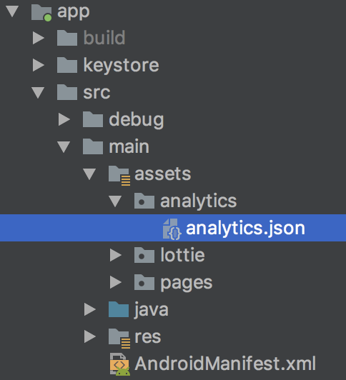
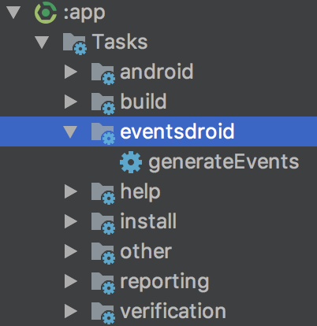

# Eventsdroid
Gradle plugin responsible for automatic analytics events classes generation based on a certain JSON-schema.

## How to generate JSON-schema?

Google Sheets event tables for all Android projects can be found here:
https://docs.google.com/spreadsheets/d/1lqWxffdA32sdVcldZMrzwPnuO3VTuE5xz4BJlJ2HQHw/edit#gid=421475800

1. Select `Export JSON` option in Google Sheets status bar and click `Configure Export`.



2. This will transpose this Google Sheets table and convert it to JSON with GoogleScript. Leave
all selected option as is except for the third one, where you should choose `Merged categories with events & parameters`.



The other ones will generate the JSON-schema of yet unsupported format for this generator.

3. Then press `Export Active Sheet` button.



4. You'll probably be routed to the error dialog which looks like the one on the screenshot below, but feel
free to omit it and just press OK in this case.



5. As a result, you'll see the Exported JSON dialog with the JSON-schema of events you require. Just
copy all content of the text field and paste it to the corresponding `*.json` file with analytics events schema in your project.



## How to generate Kotlin event classes?
Let's assume, you already have analytics events JSON-schema, which has a certain pattern.
For now, this plugin works only with this one:

```JSON
[
  {
    "name": "programs",
    "events": [
      {
        "name": "trainings_list_view",
        "parameters": [
          {
            "name": "screen_name",
            "value": "trainings"
          },
          {
            "name": "program",
            "value": "null"
          }
        ]
      },
      {
        "name": "screen_view",
        "parameters": [
          {
            "name": "screen_name",
            "value": "trainings"
          }
        ]
      },
      {
        "name": "screen_view1",
        "parameters": [
          {
            "name": "result",
            "value": "test"
          },
          {
            "name": "screen_name",
            "value": "trainings"
          }
        ]
      }
    ]
  },
  {
    "name": "Settings",
    "events": [
      {
        "name": "view",
        "parameters": [
          {
            "name": "name",
            "value": "null"
          },
          {
            "name": "screen_name",
            "value": "trainings"
          },
          {
            "name": "value",
            "value": "null"
          }
        ]
      }
    ]
  }
]
```

Basically, it represents list of different categories.
Each category contains list of events.
Each event consists of parameters (including the *required* one - `screen_name`), some of them may have already defined values, 
represented by `value` fields.

What it will generate, is ready-to-use data classes and objects each representing single event entry and 
deriving from `BaseEvent` entity (which itself will also be automatically generated):

```kotlin
open class BaseEvent(
        val categoryName: String,
        val screenName: String,
        val eventName: String,
        val params: Map<String, String>
)
```

All event data classes and objects are enclosed in the object, which represents the whole analytics category.

For the JSON above, this structure will look this way:

```kotlin
object ProgramsEvents {
    data class TrainingsListViewEvent(val program: String) : BaseEvent("programs", "trainings", "trainings_list_view", mapOf("program" to program))

    object ProgramsEvents : BaseEvent("programs", "trainings", "screen_view", emptyMap())

    data class ScreenView1Event(val result: String) : BaseEvent("programs", "trainings", "screen_view1", mapOf("result" to result))

    object Values {
        const val RESULT_TEST: String = "test"
    }
}
```

"null" values will be ignored.

### Q: In which case objects, and in which one data classes are generated?

Objects are generated for the events which require no custom parameters (except for screen_name, which is considered 
as required, and isn't optional).

Data classes are generated for the events with custom parameters, which are collected into custom parameters `Map<String, String>`.

### Q: What does `object Values { //... }` stand for?

It stands for predefined constant values which are accepted for different event parameters in the scope of this
events category.

## How to use

### 1. Apply gradle plugin.

In your project-level `build.gradle` file add:

```groovy
repositories {
    maven { url "https://plugins.gradle.org/m2/" }
}

dependencies {
    classpath "gradle.plugin.eventsdroid:com.betterme.eventsdroid:0.1.21"
}
```

At the top of your module-level `build.gradle` add:

```groovy
apply plugin: 'com.betterme.eventsdroid'
```

### 2. Copy your JSON-schema with analytics events to a chosen path



Assets folder would fit the best, but you may choose any other path convenient for you.

### 3. Add events generation task to module-level build.gradle

Example:
```groovy
generateEvents {
    eventsSchemaFile = file("${rootDir}/app/src/main/assets/analytics/analytics.json")
    destPath = file("${rootDir}/analytics/src/main/java")
    packageName = "com.gen.bettermeditation.events"
}
```

`eventsSchemaFile` represents the file accessible with the exact path to events schema.
`destPath` represents the destination folder where analytics classes will be extracted.
`packageName` represents destination package name, by which generated analytics classes will be accessbile.

### 4. Trigger generateEvents task 

There are two ways to do it.

1) You can trigger `generateEvents` task in Gradle panel in Android Studio.
It had to appear in newly created `eventsdroid` group folder.



2) Also, you can trigger this task with this simple command in Terminal:

```
./gradlew generateEvents
```

That's it!
